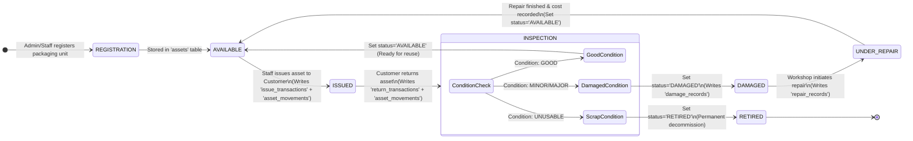

# Smart Returnable Packaging Tracking and Lifecycle Management System (SRPT-LMS)

A complete beginner-friendly full-stack DBMS BTech capstone project built with **Java Spring Boot**, **Spring Data JPA**, **MySQL**, **HTML5**, **Bootstrap 5**, and **Vanilla JavaScript**.

---

## 📋 System Architecture & End-to-End Data Flow

```
[ Frontend: HTML5 / CSS3 / Bootstrap 5 / Vanilla JS Fetch API ]
                          │
                   (REST API JSON)
                          ▼
[ Backend: Spring Boot 3.x / Controller / Service / Repository ]
                          │
                 (Spring Data JPA / ORM)
                          ▼
[ Database: MySQL 8.x (10 Normalized 3NF Tables & Views) ]
```

---

## 🔄 Project Data Flow Chart (Where Data Originates & Goes)

### 1. End-to-End System Data Pipeline
The following flowchart illustrates the complete journey of data from user actions on the browser to database persistence and back to analytical dashboards.

```mermaid
flowchart TD
    %% Actors
    subgraph Users ["👤 User Personas"]
        Admin["👑 System Admin"]
        Staff["👷 Warehouse Staff"]
        Manager["👔 Logistics Manager"]
    end

    %% Frontend UI Layer
    subgraph UI ["🌐 Client Web Interface (HTML5 / Bootstrap 5 / JS)"]
        LoginPage["login.html (Auth Portal)"]
        AssetPages["assets.html / packaging-types.html (Catalog)"]
        OpsPages["issue-asset.html / return-asset.html (Operations)"]
        MaintPages["damage.html / repairs.html (Maintenance)"]
        DashPage["dashboard.html / reports.html (Analytics)"]
        AuditPage["asset-history.html (360° Audit Trail)"]
    end

    %% REST API Layer
    subgraph API ["⚙️ Spring Boot REST Controllers (HTTP / JSON)"]
        AuthController["AuthController (/api/auth)"]
        AssetController["AssetController (/api/assets)"]
        IssueController["IssueController (/api/issues)"]
        ReturnController["ReturnController (/api/returns)"]
        DamageController["DamageController (/api/damages)"]
        RepairController["RepairController (/api/repairs)"]
        ReportController["ReportController (/api/reports)"]
        HistoryController["AssetHistoryController (/api/assets/{id}/history)"]
    end

    %% Service / Business Logic Layer
    subgraph Service ["🧠 Business Logic & State Machine Service Layer"]
        AuthService["AuthService\n(BCrypt Hash Verification)"]
        AssetService["AssetService\n(Commissioning & Status Check)"]
        IssueService["IssueService\n(State: AVAILABLE ➔ ISSUED\n+ Auto-log Outward Movement)"]
        ReturnService["ReturnService\n(Condition Evaluation\n+ Auto-log Inward Movement)"]
        RepairService["RepairService\n(State: DAMAGED ➔ UNDER_REPAIR ➔ AVAILABLE\n+ Cost Accumulation)"]
        ReportService["ReportService\n(Overdue Calc & Aggregate KPIs)"]
    end

    %% Database Storage Layer
    subgraph Database ["🗄️ MySQL 8.0 Database (3NF Tables)"]
        T_Users[("users")]
        T_Masters[("customers / packaging_types / warehouses")]
        T_Assets[("assets")]
        T_Issues[("issue_transactions")]
        T_Returns[("return_transactions")]
        T_Damages[("damage_records")]
        T_Repairs[("repair_records")]
        T_Movements[("asset_movements")]
    end

    %% Flow Connections: Users to UI
    Admin -->|"Manage Masters & Users"| LoginPage & AssetPages
    Staff -->|"Issue, Return, Damage, Repairs"| OpsPages & MaintPages
    Manager -->|"View KPIs, Overdue, Cost Reports"| DashPage & AuditPage

    %% UI to API
    LoginPage -->|"POST Credentials"| AuthController
    AssetPages -->|"GET / POST Asset Data"| AssetController
    OpsPages -->|"POST Issue / Return Payloads"| IssueController & ReturnController
    MaintPages -->|"POST Damage / Repair Payloads"| DamageController & RepairController
    DashPage -->|"GET Metrics & Filters"| ReportController
    AuditPage -->|"GET Asset Timeline"| HistoryController

    %% API to Service Layer
    AuthController --> AuthService
    AssetController --> AssetService
    IssueController --> IssueService
    ReturnController --> ReturnService
    DamageController --> RepairService
    RepairController --> RepairService
    ReportController --> ReportService
    HistoryController --> AssetService

    %% Service Layer to Database
    AuthService <-->|"Query user & verify password"| T_Users
    AssetService <-->|"CRUD Assets & Masters"| T_Assets & T_Masters
    IssueService -->|"1. Set status = ISSUED"| T_Assets
    IssueService -->|"2. Insert issue record"| T_Issues
    IssueService -->|"3. Insert movement (Origin ➔ Customer)"| T_Movements

    ReturnService -->|"1. Update issue return date"| T_Issues
    ReturnService -->|"2. Insert return transaction"| T_Returns
    ReturnService -->|"3. Insert movement (Customer ➔ Warehouse)"| T_Movements
    ReturnService -->|"4. Update status (AVAILABLE / DAMAGED / RETIRED)"| T_Assets
    ReturnService -.->|"5. If Damaged ➔ Auto-create damage log"| T_Damages

    RepairService -->|"1. Log damage / repair ticket"| T_Damages & T_Repairs
    RepairService -->|"2. Transition: DAMAGED ➔ UNDER_REPAIR ➔ AVAILABLE"| T_Assets

    ReportService <-->|"Aggregate queries, compute overdue, calculate ROI"| T_Assets & T_Issues & T_Returns & T_Repairs & T_Damages

    %% Response Flow (Feedback)
    Database -.->|"Entities / ResultSets"| Service
    Service -.->|"DTO Responses"| API
    API -.->|"JSON Data"| UI
```



---

### 2. Operational Asset Lifecycle & Data Movement Flow



---

### 3. Data Routing Matrix (From Where ➔ To Where)

| # | Action / Event | Origin (From Where) | Destination (To Where) | Data Payload Carried | Database Tables Modified / Queried |
|---|---|---|---|---|---|
| **1** | **User Login** | Browser Login Form | `AuthController` $\rightarrow$ `AuthService` | Email, Plain Password | Queries `users` table, returns JWT/Role info |
| **2** | **Asset Commissioning** | Asset Creation Form | `AssetController` $\rightarrow$ `AssetService` | Code, Type ID, Warehouse ID, Capacity, Purchase Cost | Inserts into `assets` (Status: `AVAILABLE`) |
| **3** | **Asset Issue (Outward)** | Issue Asset Form | `IssueController` $\rightarrow$ `IssueService` | Asset ID, Customer ID, Warehouse ID, Expected Return Date | Updates `assets.status='ISSUED'`, Inserts `issue_transactions`, Inserts `asset_movements` (Warehouse $\rightarrow$ Customer) |
| **4** | **Asset Return (Inward)** | Return Asset Form | `ReturnController` $\rightarrow$ `ReturnService` | Issue ID, Return Date, Condition (`GOOD`/`DAMAGED`/`UNUSABLE`), Notes | Updates `issue_transactions`, Inserts `return_transactions`, Inserts `asset_movements` (Customer $\rightarrow$ Warehouse), Updates `assets.status` |
| **5** | **Damage Logging** | Inspection / Return | `DamageController` $\rightarrow$ `RepairService` | Asset ID, Damage Type, Severity, Estimated Cost | Inserts `damage_records`, Updates `assets.status='DAMAGED'` |
| **6** | **Repair Completion** | Repair Workshop Form | `RepairController` $\rightarrow$ `RepairService` | Damage ID, Workshop Name, Actual Cost, Resolution Notes | Inserts/Updates `repair_records`, Updates `assets.status='AVAILABLE'` |
| **7** | **360° Asset History** | Asset Timeline Page | `AssetHistoryController` | Asset ID | Joins `assets`, `issue_transactions`, `return_transactions`, `damage_records`, `repair_records`, `asset_movements` |
| **8** | **Manager Reports & KPIs** | Dashboard & Reports | `ReportController` $\rightarrow$ `ReportService` | Date Range, Warehouse ID, Filter Criteria | Aggregate queries over `assets`, `issue_transactions`, `repair_records` for Overdue & Cost analytics |

---

## 🗄️ Database Setup (MySQL)

1. Open **MySQL Workbench** or MySQL CLI.
2. Execute the DDL schema script:
   ```sql
   SOURCE database/schema.sql;
   ```
3. Execute the realistic sample dataset script:
   ```sql
   SOURCE database/sample_data.sql;
   ```

---

## ⚙️ Backend Setup (Spring Boot)

1. Open the project in **IntelliJ IDEA** (or VS Code).
2. Check `backend/src/main/resources/application.properties` and ensure your MySQL password matches:
   ```properties
   spring.datasource.username=root
   spring.datasource.password=your_mysql_password
   ```
3. Run the application:
   - Run `PackagingTrackingApplication.java`, OR
   - Run in terminal:
     ```bash
     cd backend
     mvn spring-boot:run
     ```
4. Server starts on: **`http://localhost:8080`**

---

## 🌐 Frontend Setup

1. Open `frontend/index.html` or `frontend/login.html` directly in your web browser or via VS Code **Live Server** (`http://127.0.0.1:5500/frontend/login.html`).

---

## 🔑 Default Demo Login Credentials

| Role | Email | Password | Privileges |
|---|---|---|---|
| **ADMIN** | `admin@packaging.com` | `admin123` | Full access: Users, Masters, Assets, Transactions, Reports |
| **WAREHOUSE_STAFF** | `staff@packaging.com` | `staff123` | Operational access: Issue, Return, Damage, Repair, Movement |
| **MANAGER** | `manager@packaging.com` | `manager123` | Analytical access: Dashboard, Overdue, Cost & Inventory Reports |

---

## 📁 Repository Structure

```
Smart-Returnable-Packaging-Tracking-Lifecycle-Management-System/
├── backend/                               # Spring Boot 3.2 Java Backend
│   ├── pom.xml                            # Maven Dependencies
│   └── src/main/java/com/packaging/
│       ├── PackagingTrackingApplication.java
│       ├── config/                        # CORS & Security Config
│       ├── controller/                    # 12 REST Controllers
│       ├── dto/                           # Request/Response DTOs
│       ├── entity/                        # 10 JPA Entities & 5 Enums
│       ├── exception/                     # Global Exception Handling
│       ├── repository/                    # 10 Spring Data JPA Repositories
│       └── service/                       # Business Logic & State Machines
├── frontend/                              # Responsive Web Interface
│   ├── css/styles.css                     # Custom Industrial CSS Theme
│   ├── js/api.js                          # Fetch API Client SDK
│   ├── js/auth.js                         # Dynamic Role-Based Nav
│   ├── index.html                         # Home / Landing Page
│   ├── login.html                         # Login Portal with Quick-Select
│   ├── dashboard.html                     # Real-Time KPI Dashboard
│   ├── assets.html                        # Asset Registry & Filters
│   ├── issue-asset.html                   # Outward Dispatch Workflow
│   ├── return-asset.html                  # Return & Inspection Workflow
│   ├── damage.html                        # Damage Incident Logs
│   ├── repairs.html                       # Workshop Repair Tickets
│   ├── movements.html                     # Facility Transfer Logs
│   ├── asset-history.html                 # 360° Timeline Audit View
│   ├── overdue.html                       # Overdue Returns Monitor
│   ├── reports.html                       # Manager Analytics & Summaries
│   ├── customers.html                     # Customer Management
│   ├── packaging-types.html               # Packaging Master Catalog
│   ├── warehouses.html                    # Facility Hubs Directory
│   └── users.html                         # User Administration (Admin)
├── database/
│   ├── schema.sql                         # 10 Tables, Constraints, Views, Indexes
│   ├── sample_data.sql                    # Realistic Dataset with 22 Assets
│   ├── queries.sql                        # Demonstration & Viva SQL Queries
│   └── reports.sql                        # Analytical Manager SQL Queries
└── documentation/
    ├── ER-diagram.md                      # Mermaid ER Diagram
    ├── DFD-level0-level1.md               # Context & Level 1 DFDs
    ├── usecase-and-class-diagrams.md      # UML Use Case & Class Diagrams
    ├── viva-questions.md                  # 30+ Comprehensive Viva Q&A
    ├── demonstration-guide.md             # Click-by-Click Presentation Guide
    ├── project-report.md                  # Formal Academic Report
    └── SRPT-LMS.postman_collection.json   # Postman Collection for Testing
```