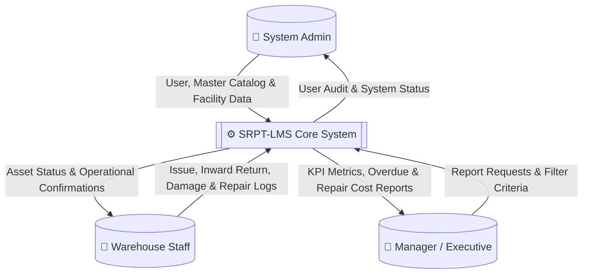
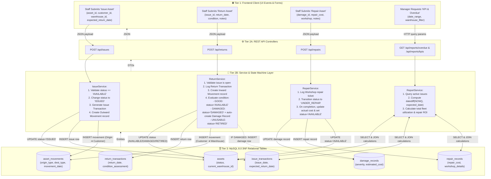

# Data Flow Diagrams (DFD): SRPT-LMS

## 1. Context Diagram (DFD Level 0)

The Level 0 DFD illustrates the boundary of the system, external entities, and major high-level data streams.

---

## 2. Detailed Functional Diagram (DFD Level 1)

The Level 1 DFD decomposes the system into its core functional sub-processes and shows interactions with the 10 data stores.

```mermaid
graph TD
    %% Entities
    Admin[("👤 Admin")]
    Staff[("👷 Staff")]
    Manager[("👔 Manager")]

    %% Processes
    P1["1.0 Authentication & RBAC"]
    P2["2.0 Master Data Management"]
    P3["3.0 Asset Commissioning"]
    P4["4.0 Issue & Dispatch Engine"]
    P5["5.0 Return & Inspection Engine"]
    P6["6.0 Damage & Repair Lifecycle"]
    P7["7.0 Analytics & Overdue Reports"]

    %% Data Stores
    D1[("D1: users")]
    D2[("D2: customers")]
    D3[("D3: packaging_types")]
    D4[("D4: warehouses")]
    D5[("D5: assets")]
    D6[("D6: issue_transactions")]
    D7[("D7: return_transactions")]
    D8[("D8: damage_records")]
    D9[("D9: repair_records")]
    D10[("D10: asset_movements")]

    %% Flows
    Admin -->|"Credentials"| P1
    Staff -->|"Credentials"| P1
    Manager -->|"Credentials"| P1
    P1 <-->|"Verify & Hash"| D1

    Admin -->|"Manage Masters"| P2
    P2 <-->|"CRUD"| D2
    P2 <-->|"CRUD"| D3
    P2 <-->|"CRUD"| D4

    Staff -->|"Register Asset"| P3
    P3 -->|"Save Asset (AVAILABLE)"| D5

    Staff -->|"Checkout Asset"| P4
    P4 <-->|"Check AVAILABLE & Set ISSUED"| D5
    P4 -->|"Log Issue"| D6
    P4 -->|"Auto-log Movement"| D10

    Staff -->|"Inspect Return"| P5
    P5 <-->|"Set AVAILABLE / DAMAGED / RETIRED"| D5
    P5 -->|"Log Return"| D7
    P5 -->|"Auto-log Inward Transit"| D10

    Staff -->|"Record Damage & Repairs"| P6
    P6 <-->|"Set UNDER_REPAIR / AVAILABLE"| D5
    P6 -->|"Log Damage"| D8
    P6 -->|"Log Repair & Cost"| D9

    Manager -->|"Query Reports"| P7
    P7 <-->|"Read Status"| D5
    P7 <-->|"Calculate Overdue"| D6
    P7 <-->|"Sum Repair Costs"| D9
    P7 -->|"Deliver Dashboards"| Manager
```

---

## 3. End-to-End Operational Data Journey (From UI to DB & Back)

The following flowchart maps the exact path of data through the 3-tier technology stack for core transactional workflows:

---

## 4. Comprehensive Data Movement Mapping Matrix

| Source Process / Origin | Action / Trigger | Data Elements In Flight | Destination / Storage | Output Produced |
|---|---|---|---|---|
| **Admin Portal** | Create Packaging Master | Type Name, Material, Dimensions, Max Capacity (kg), Tare Weight | `packaging_types` table | New packaging profile active for asset assignment |
| **Admin Portal** | Register Warehouse | Facility Name, Code, City, Address, Contact | `warehouses` table | New regional hub ready for inventory stock |
| **Warehouse Portal** | Register Asset Unit | Asset Code, Packaging Type ID, Warehouse ID, Purchase Date, Cost | `assets` table (`status='AVAILABLE'`) | Barcoded asset unit added to fleet registry |
| **Checkout Portal** | Issue Outward Packaging | Asset ID, Customer ID, Warehouse ID, Expected Return Date | `issue_transactions`, `assets` (`status='ISSUED'`), `asset_movements` | Dispatch gate pass generated & asset marked in-transit/issued |
| **Inward Gate** | Return & Inspection | Issue ID, Return Date, Condition (`GOOD`/`DAMAGED`/`UNUSABLE`), Notes | `return_transactions`, `assets`, `asset_movements`, `damage_records` (conditional) | Return receipt; asset state routed to available, repair, or scrap |
| **Workshop Gate** | Maintenance & Repair | Damage ID, Workshop Details, Repair Action, Actual Cost | `repair_records`, `damage_records`, `assets` (`status='AVAILABLE'`) | Maintenance log closed; asset restored to active duty |
| **Audit Portal** | 360° Asset History Inquiry | Asset ID / Tag | Consolidated query across `assets`, `issues`, `returns`, `damages`, `repairs`, `movements` | Complete chronological lifetime audit timeline |
| **Executive Dashboard** | Analytics Request | Filter parameters (Date, Hub, Customer) | Dynamic SQL aggregation over `assets`, `issue_transactions`, `repair_records` | Real-time KPIs, overdue lists, repair expenses |

