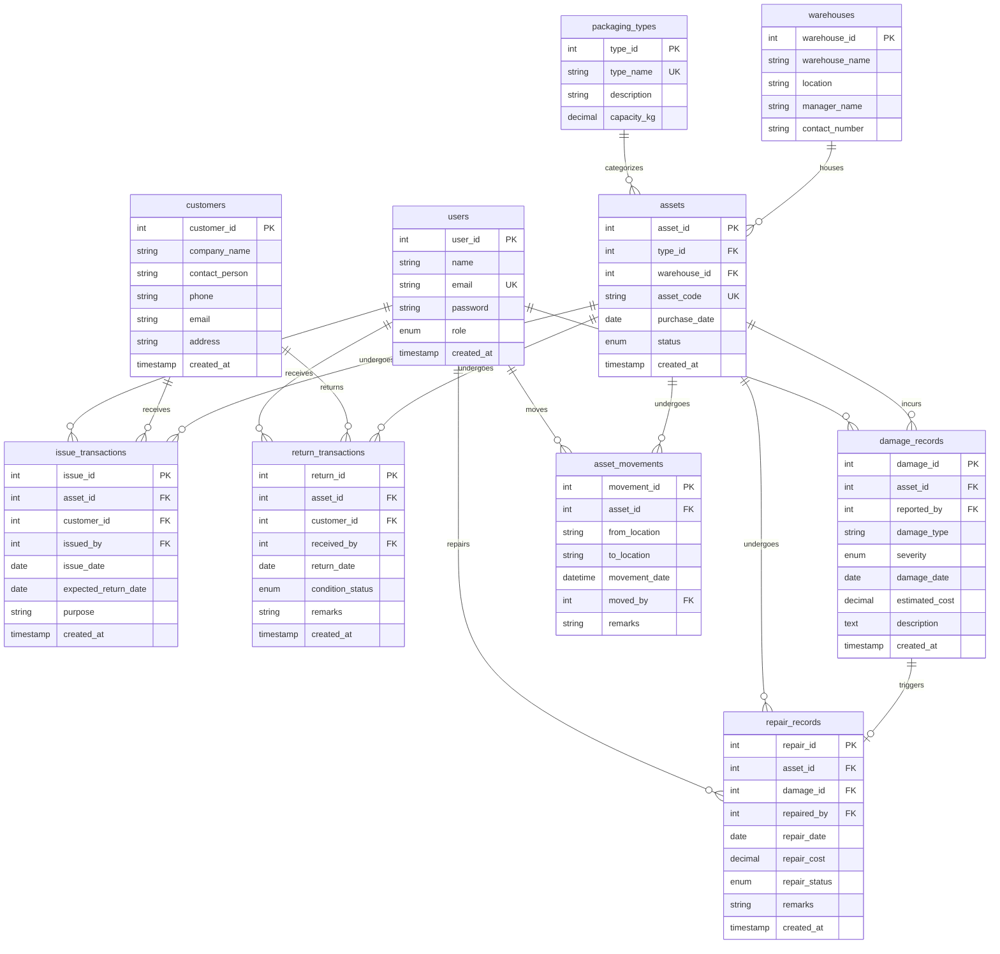

# Entity-Relationship (ER) Diagram: SRPT-LMS

The following Entity-Relationship Diagram models all 10 core tables in **3rd Normal Form (3NF)** with exact primary keys, foreign keys, and cardinalities.

---

## Relationship Cardinalities Summary

1. **`packaging_types` to `assets` (1 : M)**: One packaging type classifies multiple asset instances. Each asset belongs to exactly one packaging category.
2. **`warehouses` to `assets` (1 : M)**: One warehouse hub manages multiple assets. Each asset has one assigned home base.
3. **`customers` to `issue_transactions` (1 : M)**: One customer can receive multiple packaging shipments over time.
4. **`assets` to `issue_transactions` (1 : M)**: One reusable packaging unit undergoes multiple checkout issues throughout its service lifespan.
5. **`assets` to `return_transactions` (1 : M)**: One asset accumulates a log of historical returns and condition reports.
6. **`damage_records` to `repair_records` (1 : 1 or 1 : 0)**: A damage incident report can optionally trigger a workshop repair order.
