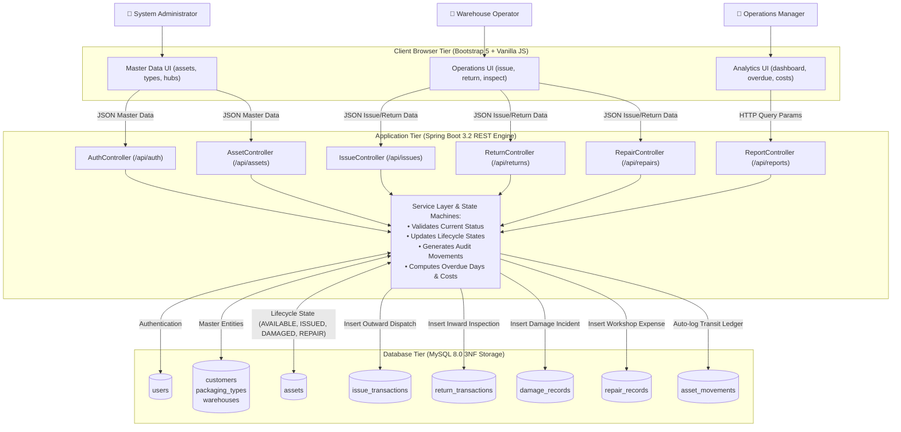

# Smart Returnable Packaging Tracking and Lifecycle Management System (SRPT-LMS)

## Academic Project Report

**Degree:** Bachelor of Technology (B.Tech) in Computer Science & Engineering / Information Technology  
**Subject:** Database Management Systems (DBMS) Capstone Project  
**Project Title:** Smart Returnable Packaging Tracking and Lifecycle Management System (SRPT-LMS)  

---

## 1. Introduction & Problem Statement

In manufacturing, automotive, and retail logistics supply chains, companies utilize expensive returnable packaging assets such as heavy-duty collapsible metal containers, high-density polyethylene (HDPE) crates, Euro pallets, chemical drums, and insulated thermal boxes. 

Traditional tracking methods rely on manual gate registers, spreadsheets, and telephone calls. This results in:
- High asset loss rates and unrecorded shrinkage.
- Inability to identify overdue returns and assess holding penalties.
- Untracked damage incidents with no historical repair cost visibility.
- Lack of centralized multi-warehouse inventory visibility.

**SRPT-LMS** is a full-stack web application powered by a 3rd Normal Form (3NF) relational database that automates the end-to-end lifecycle of reusable packaging fleets.

---

## 2. System Architecture & Tech Stack

### Architecture
- **Client Tier:** HTML5, Bootstrap 5, Custom CSS3, Vanilla JavaScript (ES6 Fetch API).
- **Application Tier:** Java 17, Spring Boot 3.2, Spring Web, Spring Data JPA / Hibernate, Spring Security Crypto.
- **Database Tier:** MySQL 8.0+ (10 Relational Tables, Foreign Key Constraints, Indexes, Views).

---

## 3. Database Normalization & Design

The database schema is strictly normalized up to **3rd Normal Form (3NF)**:
1. **1NF:** Atomic attributes, primary keys on all tables, no multi-valued columns.
2. **2NF:** No partial dependencies; all non-prime attributes are fully functionally dependent on surrogate primary keys.
3. **3NF:** No transitive dependencies. Customer addresses and phone numbers reside exclusively in `customers`; packaging capacity specs reside exclusively in `packaging_types`.

### 10 Core Relational Tables:
1. `users` (Authentication & RBAC)
2. `customers` (Client organizations)
3. `packaging_types` (Material & capacity master)
4. `warehouses` (Regional logistics hubs)
5. `assets` (Tracked physical asset units)
6. `issue_transactions` (Outward checkout logs)
7. `return_transactions` (Inward return & condition assessment logs)
8. `damage_records` (Incident reporting & estimated costs)
9. `repair_records` (Workshop maintenance & actual repair expenditure)
10. `asset_movements` (Origin-to-destination transit logs)

---

## 4. Key Business Logic & State Transitions

```
[REGISTRATION] -> AVAILABLE -> ISSUED -> RETURNED (INSPECTION)
                                         ├── Condition: GOOD -> AVAILABLE
                                         ├── Condition: MINOR/MAJOR DAMAGE -> DAMAGED -> UNDER_REPAIR -> AVAILABLE
                                         └── Condition: UNUSABLE -> RETIRED
```

---

## 5. End-to-End Project Data Flow & Routing Pipeline

The following flowchart documents the end-to-end traversal of data across Client UI, Spring Boot API Controllers, Service State Machines, and the 3NF MySQL Database:



### Data Routing Architecture Summary:
1. **Inward/Outward Data Flow:** Operational data submitted by warehouse staff via REST controllers initiates synchronized transactional writes across operational tables (`issue_transactions`/`return_transactions`) and tracking ledgers (`asset_movements`).
2. **State Transition Synchronization:** Status updates on `assets` are strictly guarded by backend service state machines to prevent invalid skips (e.g., an asset cannot be returned unless currently marked `ISSUED`).
3. **Analytics & Aggregation Flow:** Read-heavy reporting queries aggregate multi-table metrics (such as overdue return differentials and cumulative maintenance costs) into real-time DTO response packages for manager dashboards.

---

## 6. Summary of Results & viva Performance

- **Zero Data Redundancy:** 3NF normalization eliminated anomalous inserts and deletions.
- **Instantaneous Overdue Alerts:** Computed dynamically using date differential logic against expected return dates.
- **Full Audit Trail:** 360-degree timeline view aggregates disparate operational tables into a unified chronological log for any given asset.

