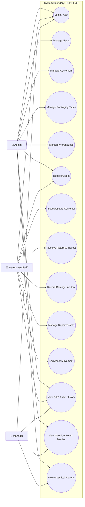
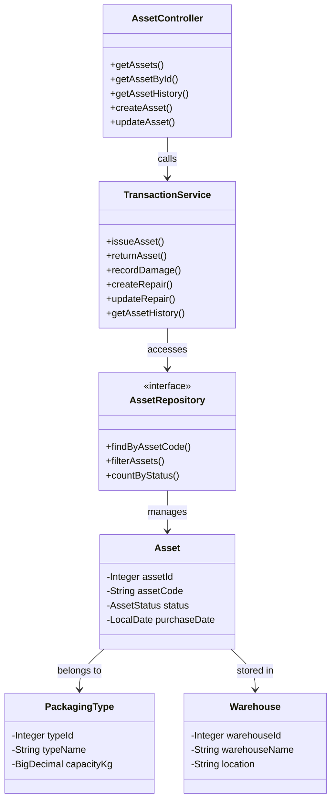

# Use Case & Class Diagrams: SRPT-LMS

## 1. Use Case Diagram

```mermaid
graph LR
    subgraph System Boundary: SRPT-LMS
        UC1((Login / Auth))
        UC2((Manage Users))
        UC3((Manage Customers))
        UC4((Manage Packaging Types))
        UC5((Manage Warehouses))
        UC6((Register Asset))
        UC7((Issue Asset to Customer))
        UC8((Receive Return & Inspect))
        UC9((Record Damage Incident))
        UC10((Manage Repair Tickets))
        UC11((Log Asset Movement))
        UC12((View 360° Asset History))
        UC13((View Overdue Return Monitor))
        UC14((View Analytical Reports))
    end

    Admin["👤 Admin"]
    Staff["👷 Warehouse Staff"]
    Manager["👔 Manager"]

    Admin --> UC1
    Admin --> UC2
    Admin --> UC3
    Admin --> UC4
    Admin --> UC5
    Admin --> UC6
    Admin --> UC12
    Admin --> UC13
    Admin --> UC14

    Staff --> UC1
    Staff --> UC6
    Staff --> UC7
    Staff --> UC8
    Staff --> UC9
    Staff --> UC10
    Staff --> UC11
    Staff --> UC12

    Manager --> UC1
    Manager --> UC12
    Manager --> UC13
    Manager --> UC14
```

---

## 2. Backend Layered Architecture Class Diagram

```mermaid
classDiagram
    class AssetController {
        +getAssets()
        +getAssetById()
        +getAssetHistory()
        +createAsset()
        +updateAsset()
    }
    class TransactionService {
        +issueAsset()
        +returnAsset()
        +recordDamage()
        +createRepair()
        +updateRepair()
        +getAssetHistory()
    }
    class AssetRepository {
        <<interface>>
        +findByAssetCode()
        +filterAssets()
        +countByStatus()
    }
    class Asset {
        -Integer assetId
        -String assetCode
        -AssetStatus status
        -LocalDate purchaseDate
    }
    class PackagingType {
        -Integer typeId
        -String typeName
        -BigDecimal capacityKg
    }
    class Warehouse {
        -Integer warehouseId
        -String warehouseName
        -String location
    }

    AssetController --> TransactionService : calls
    TransactionService --> AssetRepository : accesses
    AssetRepository --> Asset : manages
    Asset --> PackagingType : belongs to
    Asset --> Warehouse : stored in
```
